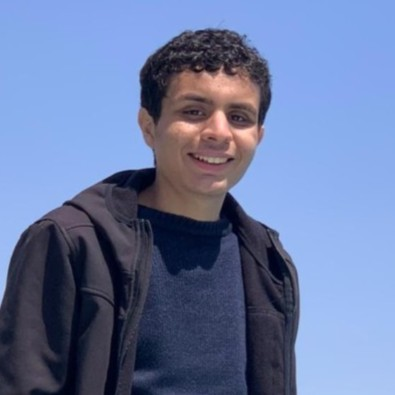
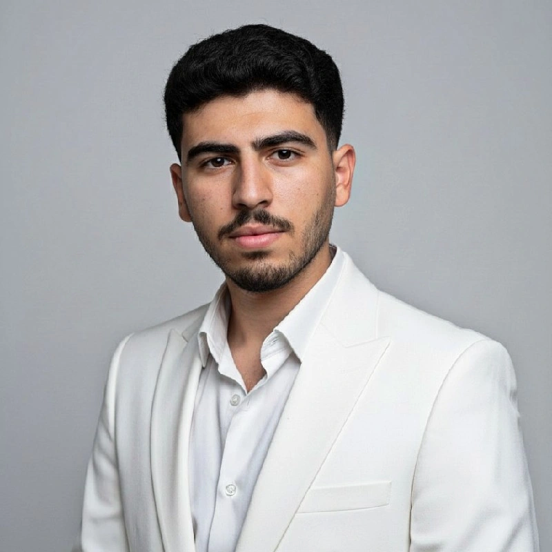
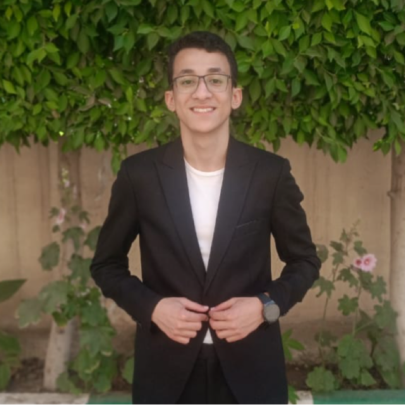
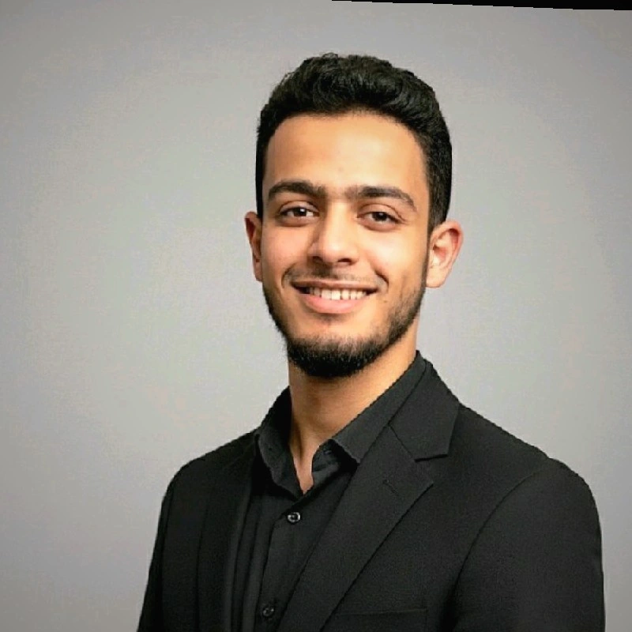

# Canny Edge Detection on RISC-V — Project README

## Project Overview

This project implements a highly optimized Canny Edge Detection pipeline
targeted for bare-metal RISC-V architectures (`riscv64-unknown-elf`).
The pipeline processes 8-bit grayscale images through a complete 7-stage
algorithm, including Gaussian Blur, Sobel operators, and Non-Maximum Suppression.

A major focus of this implementation is performance optimization utilizing
**RISC-V Vector (RVV) Extension intrinsics** to accelerate spatial gradient
computations and magnitude calculations, drastically reducing cycle counts
for embedded vision applications.

## The Team

<table style="width: 100%; border: none; border-collapse: separate; border-spacing: 20px; text-align: center;">
  <tr>
    <td style="width: 33%;">
      
      <h4 style="margin: 10px 0 2px 0;">Ahmed Wael Mohammed</h4>
      <p style="margin: 0; font-size: 0.85em; opacity: 0.8;">ID: 91240930</p>
    </td>
    <td style="width: 33%;">
      
      <h4 style="margin: 10px 0 2px 0;">Ahmed Hassan Labib</h4>
      <p style="margin: 0; font-size: 0.85em; opacity: 0.8;">ID: 91240075</p>
    </td>
    <td style="width: 33%;">
      
      <h4 style="margin: 10px 0 2px 0;">Adham Mohammed ElSadiq</h4>
      <p style="margin: 0; font-size: 0.85em; opacity: 0.8;">ID: 91240142</p>
    </td>
  </tr>
</table>

<table style="width: 66%; margin: 0 auto; border: none; border-collapse: separate; border-spacing: 20px; text-align: center;">
  <tr>
    <td style="width: 50%;">
      
      <h4 style="margin: 10px 0 2px 0;">Mohammed Sameer</h4>
      <p style="margin: 0; font-size: 0.85em; opacity: 0.8;">ID: 91240662</p>
    </td>
    <td style="width: 50%;">
      
      <h4 style="margin: 10px 0 2px 0;">Mohammed Sayed</h4>
      <p style="margin: 0; font-size: 0.85em; opacity: 0.8;">ID: 91240663</p>
    </td>
  </tr>
</table>
---

## Prerequisites

- **Toolchain:** `riscv64-unknown-elf-g++` built from source with `--with-arch=rv64gcv`
  (the apt package does not support RVV intrinsics reliably)
- **Emulator:** `qemu-riscv64` (QEMU 9.x+, built from source recommended)
- **Host tools:** `g++` (for host-side tests), Python 3 with `numpy` + `Pillow`
- WSL2 + Ubuntu 24.04 if on Windows; native Linux otherwise

---

## Project Structure

````
```text
src/
  main.cpp/.h            — pipeline driver, timing
  main_rvv.cpp           — RVV-optimized pipeline entry
  image_io.cpp/.h        — raw image I/O, aligned allocation
  gaussian.cpp/.h/.ipp   — templated 5x5 Gaussian blur
  sobel.cpp/.h           — 3x3 Sobel gradient (Gx, Gy)
  magnitude.cpp/.h       — L1 and L2 gradient magnitude
  direction.cpp/.h       — 4-way gradient direction
  nms_threshold.cpp/.h   — NMS, double thresholding, hysteresis
  rvv_*.cpp/.h           — RVV intrinsic kernels
  summary.cpp            — cycle count analysis
  syscalls.cpp           — bare-metal shims for QEMU
google_tests/            — GoogleTest framework source files
tests/                   — unit test implementations
Makefile
````

---

## Quick Start

```bash
make convert IMG=yourphoto.jpg   # convert any photo to raw grayscale (auto-detects size)
make run                         # build (-O2) and run the pipeline on QEMU
make view                        # convert output back to PNG and open it
```

You never need to manually set width/height — `make convert` saves them and every other
target reads them automatically.

---

## Makefile Targets

### Image Preparation

| Target                       | Description                         |
| ---------------------------- | ----------------------------------- |
| `make convert IMG=photo.jpg` | Convert JPG/PNG to `test_input.raw` |
| `make view_input`            | View the input image                |

### Scalar Pipeline

| Target             | Description                        |
| ------------------ | ---------------------------------- |
| `make run`         | Run scalar pipeline -> `out.raw`   |
| `make view_scalar` | View `out.raw` as `out_scalar.png` |
| `make sweep`       | -O0/-O2/-O3/-Os/-Ofast benchmark   |
| `make view_00`     | View `out_00.raw`                  |
| `make view_02`     | View `out_02.raw`                  |
| `make view_03`     | View `out_03.raw`                  |
| `make view_Os`     | View `out_Os.raw`                  |
| `make view_Ofast`  | View `out_Ofast.raw`               |

### RVV Pipeline (Phase 6)

| Target              | Description                          |
| ------------------- | ------------------------------------ |
| `make rvv`          | Build RVV binary                     |
| `make vlen_sweep`   | Run at VLEN=128/256/512              |
| `make vlen_128`     | Run RVV at VLEN=128 -> `out_rvv_128` |
| `make vlen_256`     | Run RVV at VLEN=256 -> `out_rvv_256` |
| `make vlen_512`     | Run RVV at VLEN=512 -> `out_rvv_512` |
| `make view_rvv`     | View `out_rvv_128.raw` (default)     |
| `make view_rvv_128` | View VLEN=128 output                 |
| `make view_rvv_256` | View VLEN=256 output                 |
| `make view_rvv_512` | View VLEN=512 output                 |

Override image size manually if needed: `make run W=640 H=480`. Override vector length:
`make run VLEN=256`.

---

## Phase 1 — Environment Setup ✅

- Built `riscv64-unknown-elf-g++` from source with RVV (Vector extension) support
- Built `qemu-riscv64` from source (user-mode only, for speed)
- Verified the toolchain by running an RVV test program on QEMU
- Set up dual-target Makefile (host tests vs. RISC-V cross-compile)

**Gotcha:** standard `qemu-riscv64 -cpu rv64,...` flag strings can sometimes cause
"Illegal instruction" crashes depending on QEMU build — using QEMU's **default CPU**
(no `-cpu` flag, or just `-cpu rv64,v=true,vlen=N`) is more reliable in this setup.

---

## Phase 2 — Scalar Baseline Pipeline ✅

Implemented in clean, templated C++:

- **Image I/O** — raw grayscale format (just `width*height` bytes, no headers)
- **Gaussian blur** — 5×5 kernel, integer arithmetic, zero-padding boundary, templated
  on pixel/output/accumulator type
- **Sobel gradient** — 3×3 Gx/Gy kernels, output stored as separate int16 arrays
  (Structure-of-Arrays layout, for easier vectorization later)
- **Magnitude** — both L1 (`|Gx|+|Gy|`, fast) and L2 (`sqrt(Gx²+Gy²)`, accurate)
  implemented; pipeline uses L1
- **Direction** — quantized to 4 bins (0°/45°/90°/135°) using integer
  cross-multiplication instead of `atan2()`
- **NMS & Threshold**— Implemented edge thinning , double thresholding
  categorization, and hysteresis connectivity tracking to finalize edge segments.

---

## Phase 3 — Testing ✅

- Correctness verified by checking all optimization levels (`-O0` through `-Ofast`)
  produce **bit-identical output**: `make verify`
- Verified against a real photo (720×900), confirming reasonable edge detection
  (~39% of pixels flagged as edges, which is expected for natural images with texture)

---

## Phase 4 — Compiler Optimization Sweep & Auto-Vectorization ✅

Two parts — full detail in `README_Phase4.md`, summary here:

### Optimization sweep

Measured cycle counts (via `rdcycle`, averaged over 100 runs) at 5 optimization levels.
Result: **~4.2× total speedup from `-O0` to `-Ofast`**, with zero source code changes.

| Stage     | -O0       | -O2      | -O3      | -Os      | -Ofast   |
| --------- | --------- | -------- | -------- | -------- | -------- |
| Gaussian  | 534M      | 187M     | 215M     | 215M     | 209M     |
| Sobel     | 269M      | 107M     | 18.7M    | 99M      | 18.2M    |
| Magnitude | 454M      | 66M      | 68M      | 74M      | 68M      |
| Direction | 33M       | 16M      | 16M      | 18M      | 16M      |
| **TOTAL** | **1290M** | **376M** | **317M** | **406M** | **310M** |

All five produce identical output (`make verify`).

### Auto-vectorization analysis

Using `-fopt-info-vec-all` and disassembly, checked which functions the compiler
auto-vectorized with RVV:

| Function  | Vectorized?                                                                          |
| --------- | ------------------------------------------------------------------------------------ |
| Gaussian  | ❌ No — 4-level nested loop too complex for GCC                                      |
| Sobel     | ❌ No — boundary check (`if`) inside loop blocks it                                  |
| Magnitude | ⚠️ Half — the "find max" pass is vectorized, the "normalize" pass isn't (float math) |
| Direction | ✅ Fully — compiler converted if/else chain into branchless masked operations        |

**Conclusion for Phase 6:** Gaussian needs full hand-written RVV (biggest runtime share,
zero compiler help). Magnitude needs RVV only for the normalization step. Sobel and
Direction are lower priority — the compiler already did most or all of the work.

---

## Phase 5 — Profiling ✅ (folded into Phase 4)

Per-stage percentage breakdown is printed automatically every run:

```
Gaussian  : 46.8%   ◄ HOT
Sobel     :  25.7%
Magnitude : 13.4%
Direction :  4.2%
NMS : 7.0%
Threshold: 1.1%
Hystersis:1.8%
```

Gaussian + Magnitude = ~61% of runtime → these are the Phase 6 targets. Per Amdahl's
Law, optimizing Direction further would save under 9% even if made infinitely fast, so
it's deprioritized.

---

## Phase 6 — RVV Intrinsic Optimization 🔜 (next up)

Plan based on Phase 4 findings:

1. **Gaussian** — rewrite using RVV intrinsics. Process the image interior with no
   boundary checks (handle the 2-pixel border separately in scalar code) to avoid the
   structural issues that blocked auto-vectorization.
2. **Magnitude** — keep the compiler's auto-vectorized "find max" pass; hand-write RVV
   only for the normalization pass, using a fixed-point multiply+shift instead of
   floating-point divide.
3. **Sobel / Direction** — lower priority, optional.
4. Verify scalar vs. RVV output match (±1 tolerance) at VLEN = 128, 256, and 512.

---

## Phase 7 — Report & Presentation 🔜

- Final optimization table (scalar through RVV, multiple VLEN values)
- Code walkthrough comments on every RVV intrinsic (what it does, why this LMUL, what
  changes at a different VLEN)
- Live demo on QEMU

---

## Key Files Generated So Far

- `README_Phase4.md` — detailed write-up of the optimization sweep and vectorization
  analysis, with annotated disassembly
- `vec_report.txt` — raw compiler vectorization diagnostic output
- `cycles_*.txt` — per-stage cycle counts for each optimization level
